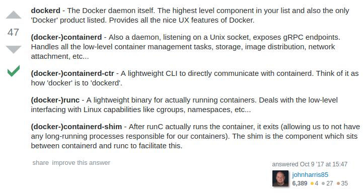

# Very basic Docker Compose example

## Basic usage, attached

This example is a very basic usage of docker-compose running an NginX container from nginx:latest

Open first terminal in this directory and check compose file content is valid for docker-compose using:
```bash
docker-compose config
```

*Notice it shows how it'll be finally seen by docker-compose, not file actual content*
If content is not properly created it will show an error and will provide a return code different from zero.

Error example:
```
ERROR: yaml.scanner.ScannerError: while scanning a simple key
  in "./docker-compose.yaml", line 8, column 1
could not find expected ':'
  in "./docker-compose.yaml", line 8, column 7
```
return code: 1


Successfully validated yaml file output:
```
networks: {}
services:
  nginx:
    image: nginx
    ports:
    - 80
version: '3.0'
volumes: {}

```
Return code: 0


Now, just run:
```
docker-compose up
```

* It will create a default network called `example001_default`. It is using folder name (project) as prefix in many different aspects.
* It will pull `nginx` image if not already downloaded by the engine.
* It will create services if not existing 
* First time running it, it will create a container called `example001_nginx_1`.
* It will attach to containers `stdout`, in this case the only container its got defined.
* After attaching no more output should be shown as `service` is not producing any.


*Open another terminal in the same directory and keep running the next commands*

Get which port it is attached to
```bash
docker container port example001_nginx_1
```
This will produce an ouput like:
```
80/tcp -> 0.0.0.0:32768
```
meaning that port `80` from container is attached to `0.0.0.0:32768` in host.
*Mind this defaults to index 1, in case of multiple instances*

Can also be obtained using docker inspect and using an external JSON parser like `jq`:
```bash
docker container inspect example001_nginx_1 | jq -r '.[0].NetworkSettings.Ports."80/tcp"[0].HostPort'
```
or using a Go template with `-f`/`--format` option.
```bash
docker container inspect --format='{{(index (index .NetworkSettings.Ports "80/tcp") 0).HostPort}}' example001_nginx_1
```

or showing compose `ps`:
```bash
docker-compose up
```

Example output:
```
       Name                Command          State           Ports         
-------------------------------------------------------------------------
example001_nginx_1   nginx -g daemon off;   Up      0.0.0.0:32769->80/tcp
```


Request your well deserved page to the `nginx` container:
```bash
MY_NGINX_PORT=$(docker container inspect --format='{{(index (index .NetworkSettings.Ports "80/tcp") 0).HostPort}}' example001_nginx_1)
curl localhost:${MY_NGINX_PORT}
```

This will:
* Show the default nginx HTML page at `curl` output
* also will produce an output into the terminal running the docker-compose command

The compose log will show something like:
```
nginx_1  | 172.19.0.1 - - [21/Jan/2019:22:49:19 +0000] "GET / HTTP/1.1" 200 612 "-" "curl/7.58.0" "-"
```

Output is parsed by docker-compose. It's composed by:
* first word, `service` name with its numeric instantiation id (usually just 1), splat by a `_` (example: `nginx_1`)
* splitter using a "pipe" symbol
* real line that got out from `service`


*Notice that date printed by nginx service is in UTC!!!*


Stop the service by running:
```
docker-compose stop
```

This will:
* request the defined docker-compose `services` to stop and finish properly.
* end up with the docker-compose execution to finish.
* not remove volumes or clean up anything at all.
* release port binding.

See compose `ps` to feel the difference from when it was running:
```
docker-compose ps
``` 

*Notice that port has been released!*

You can close the second terminal for now.
 

### Detached executions
Attached is nice but detaching is more resilient in terms of not being shell dependant.

Keeping in mind that the service, network and all its previous definitions were already created in first run just type:
```bash
docker-compose up -d
```
It will say `Starting example001_nginx_1`.

Check its status:
```
docker-compose ps
``` 

*Notice that host port has changed!!!* 

### Execute a command inside containers
#### Basic execution
Let's get a simple `ls` execution on nginx service.
```bash
docker-compose exec nginx ls
```
#### Selecting index of container on multiple instances
Using the option `--index=id` one can execute a command on desired instance of a service.
Imagine we had 2 instances of nginx service, so executing a command on second instance could be done with:
```bash
docker-compose exec --index=2 nginx ls
```
*This option defaults to 1.*

#### Execute command as a non-default user defined by image
Ok, now, let's play with users (UID) inside containers.

See which users are available in this container:
```bash
docker-compose exec nginx getent passwd
```

It has a user `nginx` with uid 101.
Try to execute `id` command on the service with:
```bash
docker-compose exec --user nginx nginx id
```
Output will be like:
```
uid=101(nginx) gid=101(nginx) groups=101(nginx)
```

It can also be done by UID:
```bash
docker-compose exec --user 101 nginx id
```
in fact, one could set any UID, even if it doesn't exists in containers `/etc/passwd`.

### Basic Top understanding
`Top` can bring up some process information on containers running in the compose context.
If no options are given it will show every defined service process info.
Let's go with it:
```bash
docker-compose top nginx
```

It will show the next columns:
* UID
* PID
* PPID
* C
* STIME
* TTY
* TIME
* CMD

Let's talk about the interesting ones...

#### Top: UID
This User ID will try to be shown in a nominal way from host table (`/etc/passwd`) instead of UID inside containers
So, if, for example uid 101 matches system's `systemd-network` user, it doesn't mean container has the same name defined for the numeric UID.

#### Top: PID
This represents the process ID in the host that is running insider the container PID namespace.
So, if PID is `16932`, using `ps` on node will show that process and will show that the command is the same as the container knows.

#### Top: PPID
This represents the `parent` PID which is shown in the host and is the directly attached to the `docker-containerd-shim`.


* Reminder: structure of docker architecture

[](https://hackernoon.com/docker-containerd-standalone-runtimes-heres-what-you-should-know-b834ef155426)

* Also interesting easy explanation on docker structure

[](https://hackernoon.com/docker-containerd-standalone-runtimes-heres-what-you-should-know-b834ef155426)

#### Top: STIME
The typical start time for the process. Only interesting thing to notice is that time is not show in UTC but in host's time zone.
 
##### Compare host process start time and container's
Nginx Image has no `ps` command, so let's do it old school.
```bash
NGINX_PID_ID_ON_CONTAINER=$(docker-compose exec nginx bash -c 'pidof nginx |  cut -d " " -f 1 | tr -d "\r" | tr -d "\n"')
docker-compose exec nginx bash -c "ls -ld /proc/${NGINX_PID_ID_ON_CONTAINER}/"
```
Output must be a `ls` limited to the directory of the process, which should show creation time.

### Scaling services running
Docker compose can scale services just by telling the amount of needed instances:
```bash
docker-compose scale nginx=2
```

### Micro Challenges
#### Execute a command on each instance
Execute command `hostname` on each of them and see the hostname is different


#### Check mapped ports
Is it the same port for each instance?

Show them using `ps` and `port` docker-compose's commands.

#### What if...
Compose yaml file only has one instance set. Yet, it was scaled to two replicas later.
* What happens if services are stopped?
* Is compose being updated?

Try:
* `Stop` services using docker-compose.
* Check YAML file.
* `start` services.

How many instances exist?

#### Scale up again
From a second terminal, without closing the one with attached outputs:
* Set it to 3 replicas
* `Curl` into the last replica

Is log being updated on the first terminal?

Just for fun, scale it down to 2 replicas. Which will it destroy?

#### Evil stuff from second terminal..
Now, from second terminal `down` the deployment by using: docker-compose down

* What are the differences from `stop` and `down`?
* Did this update compose file?
* What if we set it `up` again?


# EOF ;)
